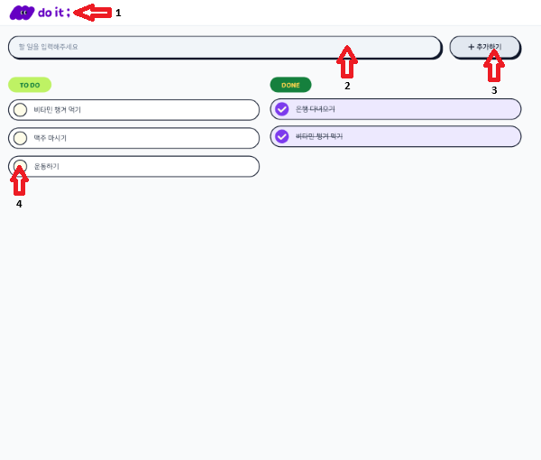
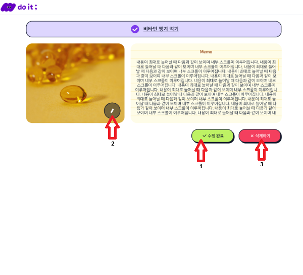
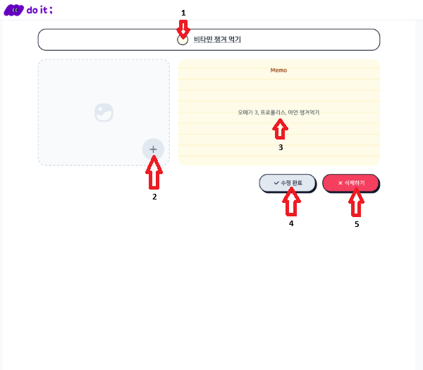

#프로젝트

## [Todo 웹](https://codeittest.vercel.app/ "클릭 시 사이트로 이동")

이미지 추가 및 수정이 가능한 Todo 관리 웹 서비스입니다.
 할 일을 등록하고, 완료 여부를 관리하며, 각 아이템에 이미지와 메모를 추가해 보다 직관적으로 Todo를 관리할 수 있습니다.

## 주요 기능

- **아이템 등록**
  - 할 일 이름 입력 후 `ENTER` 또는 **추가하기 버튼** 클릭
  - 등록 즉시 리스트에 반영

- **아이템 수정**
  - 아이템 클릭 후 수정 모드 전환하여 수정 가능
  - 메모 내용 등록 가능
  - 이미지 등록 가능
  - 완료 상태 변경 가능

- **아이템 삭제**
  - 선택한 아이템 삭제

## 사용 방법

### 1. 메인 페이지

- 1번 클릭시 `/`으로 이동
- 2번 입력 창에 내용 입력
- 3번 **추가하기** 버튼 또는 `ENTER`
- 4번 클릭 시 완료 상태 변경
- 리스트 아이템 직접 클릭 시 상세 페이지로 이동

### 2. 상세 페이지

- 1번 또는 2번 클릭 시 수정 상태로 변경
- 3번 클릭 시 해당 아이템 삭제

### 3. 수정

- 1번 클릭 시 완료 상태 변경
- 2번 클릭 시 이미지 등록 가능
- 3번 메모 입력 가능
- 4번 클릭 시 수정 완료 상태 변경 -> 메인 페이지로 이동
- 5번 클릭 시 해당 아이템 삭제

